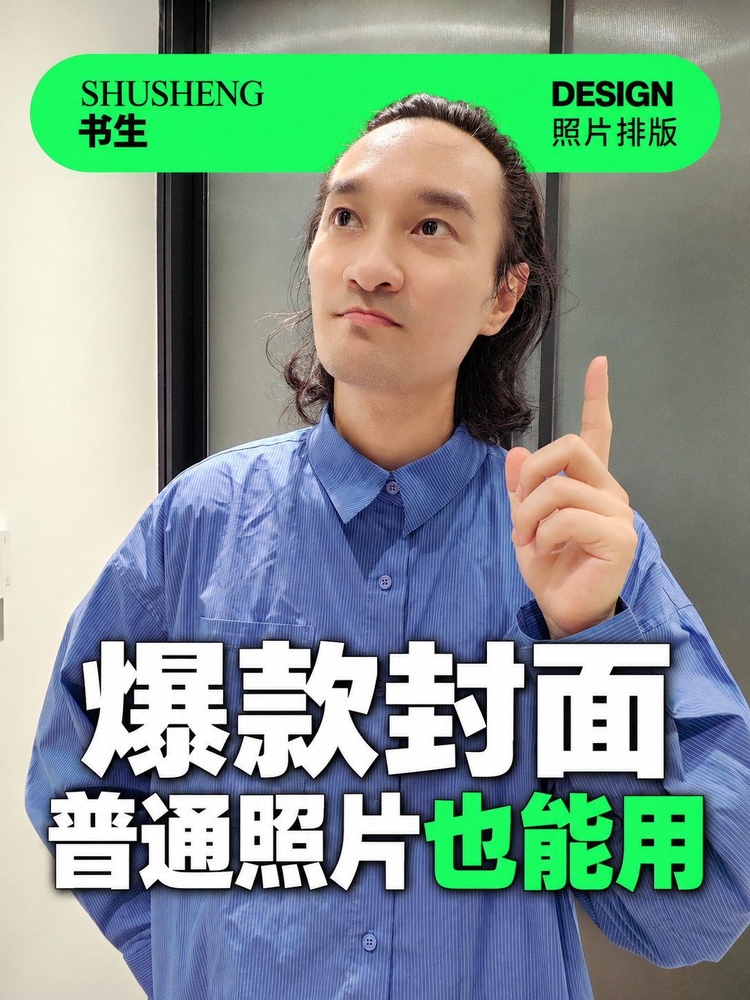
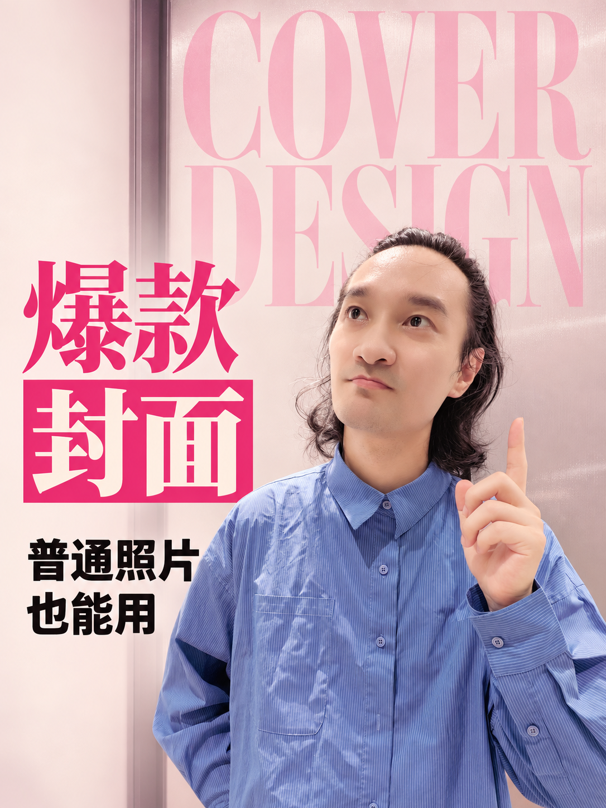

# 书生·电影感封面六式

**一张人物照，试出六种封面风格。**

从抓眼的色块排版，到有故事感的电影封面：上传自己的照片，添加 Skill，再告诉 AI 你的标题，就可以开始。

这份 Skill 把六种封面的配色、字体、排版、人物关系与检查要求整理成了一份可复用的工作说明书。六款共用一组文案，也可以单独选择喜欢的样式。

**[下载 SKILL.md](https://github.com/gafata168-cell/photo-cover-six/raw/refs/heads/main/SKILL.md) · [完整图文教程](https://my.feishu.cn/wiki/SAsPwn7j9iAZxkkJBWVcM80OnSd) · [打开即梦](https://jimeng.jianying.com/ai-tool/home?createTab=canvas)**

> **推荐使用即梦「图片 5.0 Pro / Seedream 5.0 Pro」，在画布中操作。**
> 也可以在具备图片生成能力的 Codex 中，调用 GPT 图片模型使用这套规则。模型权限、会员和生成额度以各平台当前账号页面为准。

## 先看六种效果

以下为本期视频开头展示的精选效果，按视频顺序排列。它们展示六种设计方向；实际生成会随照片、文案与模型产生差异。

| 01 绿色色块 · 抓眼 | 02 红色错位 · 设计感 | 03 粉色杂志 · 精致感 |
| --- | --- | --- |
|  |  |  |
| 亮绿色点缀关键词。 | 大字拆到两边，一高一低。 | 标题大小变化，配色块与淡英文。 |

| 04 黄色满版 · 主角感 | 05 冷蓝光影 · 故事感 | 06 蓝黄手写 · 松弛感 |
| --- | --- | --- |
|  |  |  |
| 粗犷大字撑满，人物居中，投影落地。 | 冷蓝场景、窗光与疏密排字。 | 斜向手写，配蓝天草地。 |

前三款主要保留原照动作与场景；后三款会按风格调整空间、姿势或补全人物。照片中的人物身份始终需要保留。

## 用即梦：照片 + Skill + 一句话

1. **下载文件**：点击上方「下载 SKILL.md」，保留 `.md` 格式。也可打开仓库中的 `SKILL.md`，点击下载原始文件按钮。
2. **进入画布**：打开即梦，选择「画布」。
3. **添加材料**：放上自己的照片，再添加 `SKILL.md`。确认照片和文件都已添加成功。
4. **输入文案**：复制下面这句话，替换引号中的内容，发送生成。

```text
用这个 Skill，把我上传的照片做成六种封面，每种单独生成一张。主标题是“爆款封面”，副标题是“普通照片也能用”，署名“书生”。
```

**六款共用这组文案，无需逐款填写。** 排版与模型要求已经写进 Skill，日常提示词保持简单即可。已保存到即梦技能库后，也可以通过输入框的 `/` 调用。

Skill 的演示设置为 **图片 5.0 Pro、3:4、2K**。生成前确认实际调用的是对应模型；如果页面提示会员专享，需要具备相应会员权限和可用积分。下载 Skill 本身不包含模型额度。

照片建议五官清楚、身体轮廓完整；第一次尝试可先用四字主标题和简短副标题。六张分别生成，完成后逐张放大查看。

想只做一款，可以这样说：

```text
用这个 Skill，只生成“冷蓝光影”这一款。主标题“你的标题”，副标题“你的副标题”，署名“你的名字”。
```

每一步的截图、操作演示与更多说明，都在[飞书图文教程](https://my.feishu.cn/wiki/SAsPwn7j9iAZxkkJBWVcM80OnSd)中。

## 在 Codex 中使用

将 `SKILL.md` 和人物照片交给 Codex，明确使用 **GPT 图片生成**。可复制：

```text
请用 GPT 图片生成，按照这个 Skill，把我上传的照片做成六种独立封面。主标题“爆款封面”，副标题“普通照片也能用”，署名“书生”。
```

本仓库保留即梦演示版 Skill 的六款模板，并附有作者与使用许可。上面这句明确选择 GPT 图片模型；六款排版规则继续沿用。Codex 需要有可用的图片生成工具，实际尺寸和分辨率按该工具支持的选项执行。

需要长期使用时，可以把 `SKILL.md` 放入个人技能目录 `~/.agents/skills/photo-cover-six/`，然后在 Codex 中通过 `$photo-cover-six` 调用。具体安装方式见 [OpenAI 技能说明](https://learn.chatgpt.com/docs/build-skills)，图片能力见 [OpenAI 图片生成说明](https://learn.chatgpt.com/docs/image-generation)。

## 结果不理想，怎么调整？

先检查三个地方：**文字是否准确、人物是否自然、缩到手机大小后是否清楚。**

只重跑有问题的款式，并指出具体位置，例如：

```text
重新生成粉色杂志款，使用我的原照，英文放到人物后方，露出完整五官。保持原来的标题和排版方向。
```

不同照片与文字长度会影响结果，个别款式可能需要重试。预览图用于查看设计效果，日常生成只需提供自己的原照。

## 做成自己的风格

把喜欢的参考图、这份 Skill 和自己的需求一起交给 AI，可以继续新增样式：

```text
我是【你的赛道】博主。请读取 SKILL.md，分析参考图的配色、字体、布局和人物关系，新增一个“【风格名称】”样式，保留原有六款。新样式需要适配我的照片和文案，保证文字准确、人物自然、手机上清晰可读。请输出完整的新版 SKILL.md。
```

保存后，换一张照片、换一个标题再试。把喜欢的东西一点点放进去，会越来越像你。

## 使用与分享约定

**作者官方免费分享 · 允许商用做图 · 分享保留来源 · 禁止包装转卖**

- 可以使用和修改 Skill，为自己的账号或客户生成封面；生成图无需加作者水印。
- 免费分享原版或修改版时，保留作者“书生今天也在学”、原仓库链接和许可；修改版注明修改内容与日期。
- 未经作者书面许可，禁止将 Skill、排版提示词、文字说明或沿用这些内容的修改版包装成付费资源销售，包括收费资料包及付费课程、社群、会员的文件获取权益。

本项目采用附条件的免费源码公开分享方式。完整授权范围见 [使用许可](LICENSE.md)。

## 作者与反馈

作者：**书生今天也在学**。

使用问题可以在仓库 Issues 留言，附上使用平台、模型名称和具体问题；更多操作说明与联系方式见[完整教程](https://my.feishu.cn/wiki/SAsPwn7j9iAZxkkJBWVcM80OnSd)。

模型名称参考：[Seedream 5.0 Pro 官方介绍](https://seed.bytedance.com/en/seedream5_0_pro)。
